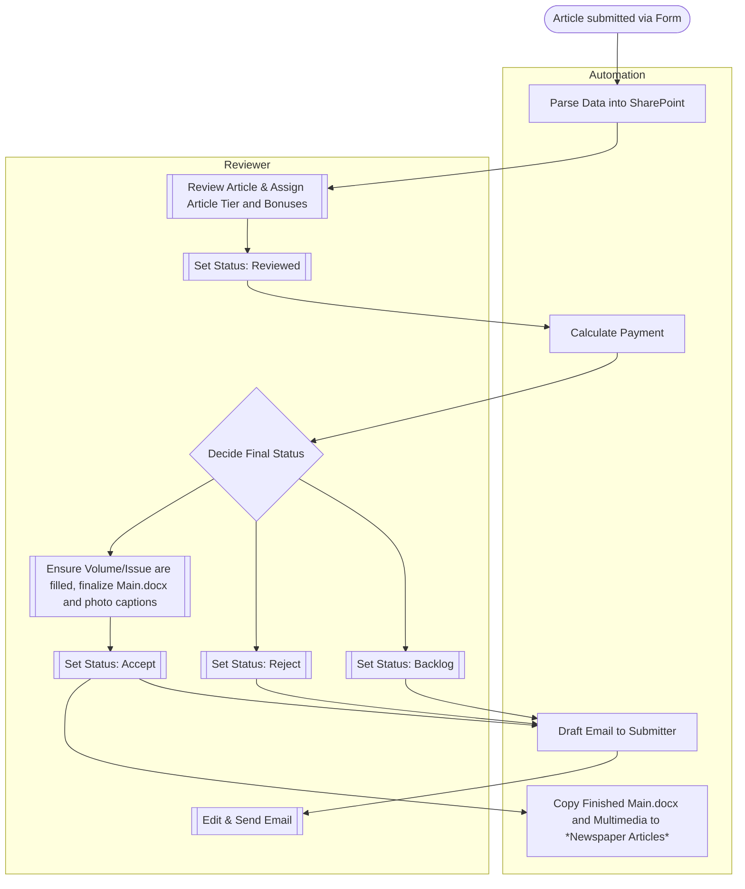

## Overview
The OTE workflow consists of interconnected Microsoft Power Automate flows designed to process article submissions. It receives input from a Microsoft Form, stores data in SharePoint, and automates documentation, cost calculation, and response email drafting.  

## Workflow Stages 
1. One flow receives the articles from `OTE Contributor Submission Form` and parses the data into a SharePoint item.
2. Then internally the article is reviewed to determine the `Article Tier` and `Bonuses`. 
   - The item is then marked under `Internal Status` as `Reviewed`.
     - This allows another flow to determine the cost of the article.
3. Afterwards the reviewer determines if the article should be backlogged, rejected, or published changing `Internal Status` to show that change.
4. The last flow drafts an email, telling the sender if their work is accepted, rejected or backlogged.
5. Lastly, the reviewer makes edits to the draft and sends it to the article sender.

## Diagram 

## Glossary
- OTE
  - Shorthand for Over the Edge
- Internal Status
  - A SharePoint column that is changed by the reviewer to move the article throughout the automation process
    - Should be moved from `Draft` -> `Reviewed` -> `Backlog` / `Accepted` / `Rejected`
- Automation Status
  - A SharePoint column that is changed by the Power Automate flows and should not be changed
    - Should move from `Processing` -> `Pending Review` -> `Calculated` -> `Drafted` -> `Filed for Publication`

## Maintenance Notes
- Avoid editing `Automation Status` manually in SharePoint; this column is managed exclusively by Power Automate
- Folder structures must remain unchanged due to downstream printer dependencies
- Any changes to the Microsoft Form structure require corresponding updates to the Forms Receiver flow

## Technical Details
- Workflow Engine: Power Automate
- Storage: SharePoint
- Mapping Source: Forms
