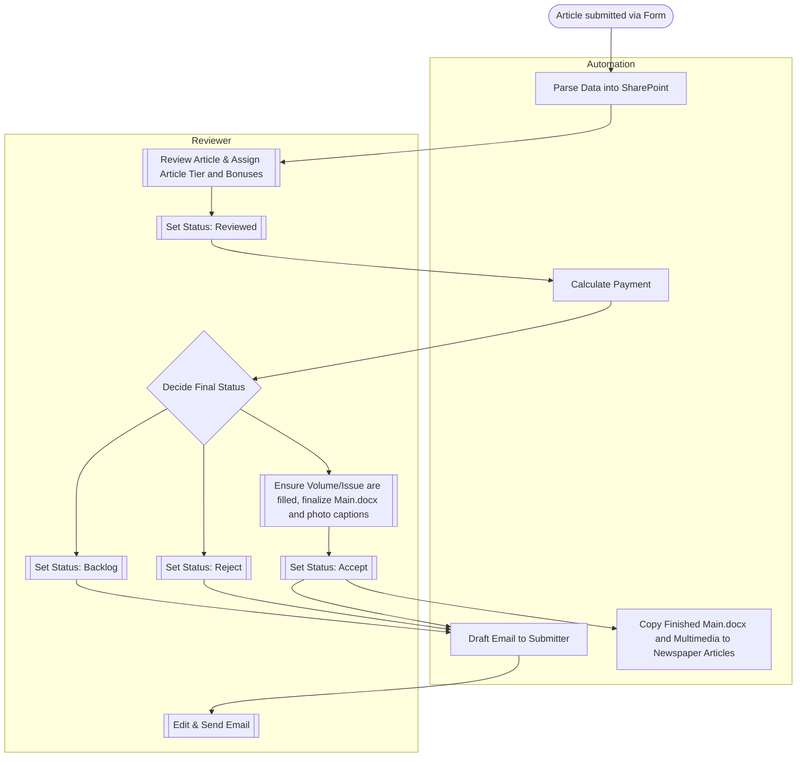

# Submission Process Workflow

The automated submission process handles article contributions from initial submission through final publication using Microsoft Power Automate flows integrated with SharePoint and Microsoft Forms.

## Overview

The OTE workflow consists of interconnected Microsoft Power Automate flows designed to process article submissions. It receives input from a Microsoft Form, stores data in SharePoint, and automates documentation, cost calculation, and response email drafting.

## Workflow Stages

1. **Submission Reception**: One flow receives articles from the `OTE Contributor Submission Form` and parses the data into a SharePoint item
2. **Internal Review**: Article is reviewed to determine the `Article Tier` and `Bonuses`, then marked as `Reviewed`
3. **Cost Calculation**: Another flow determines the cost of the article based on review decisions
4. **Status Decision**: Reviewer determines if the article should be backlogged, rejected, or published
5. **Email Draft**: System drafts an email informing the sender of acceptance, rejection, or backlog status
6. **Final Communication**: Reviewer edits the draft and sends it to the article sender

## Process Flow Diagram

## Key Terminology

### Internal Status
A SharePoint column that is changed by the reviewer to move the article throughout the automation process. Should progress from:
- `Draft` → `Reviewed` → `Backlog` / `Accepted` / `Rejected`

### Automation Status
A SharePoint column that is changed by the Power Automate flows and should **not** be changed manually. Progresses through:
- `Processing` → `Pending Review` → `Calculated` → `Drafted` → `Filed for Publication`

## Important Guidelines

### ⚠️ Critical Rules
- **Never edit `Automation Status` manually** - this column is managed exclusively by Power Automate
- **Folder structures must remain unchanged** due to downstream printer dependencies
- **Any changes to the Microsoft Form structure** require corresponding updates to the Forms Receiver flow

### Review Requirements
- **Article Tier** and **Multimedia Types** are initially guessed by submitters and **must be reviewed**
- Article Tier directly affects payment calculation and requires careful attention
- Photo captions must be completed for all multimedia before publication

## File Structure Requirements

The newspaper printing process requires a specific file structure that must be maintained:

### Article Storage
- **Location**: `Content > Content > [FirstName LastName] > [Article Name]`
- **Files**: Original submission + Main.docx template for editing

### Photo Storage
- **Location**: `[Article Name] > [Photos] > [Photo #]`
- **Requirements**: Each photo must have an accompanying caption text file
- **Numbering**: Photos are numbered in order (#1, #2, etc.)

### Publication Filing
- **Final Location**: `Content > Newspaper Articles > Volume [X] > Issue [Y] > [Article File Name]`
- **Contents**: Finalized Main.docx + Photos directory with captions

## Next Steps

- [Forms Receiver Flow](./forms-receiver) - How submissions are initially processed
- [Payment Calculator](./payment-calculator) - How article costs are determined
- [Email Drafter](./email-drafter) - How response communications are generated
- [Publication Filing](./publication-filing) - How approved articles are prepared for print
