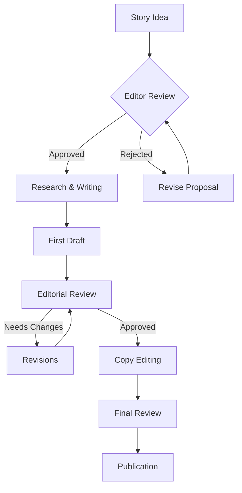
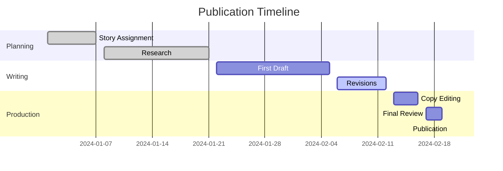
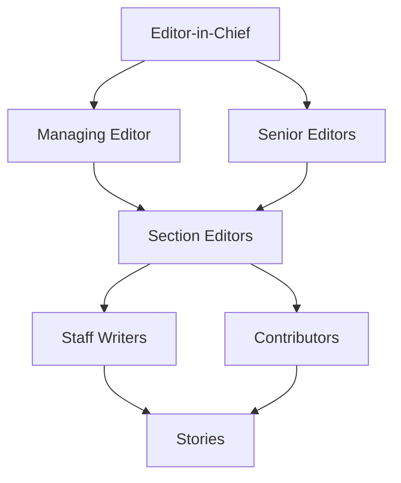
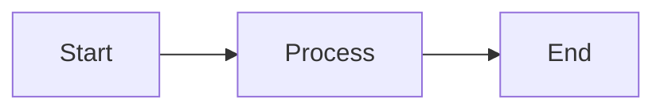

This documentation site supports Mermaid diagrams for creating flowcharts, sequence diagrams, and other visualizations.

## Workflow Diagram Example



## Publication Process Timeline



## Editorial Hierarchy



## Simple Example



## Usage

To create a Mermaid diagram in your documentation:

1. Use a code block with the `mermaid` language identifier
2. Write your diagram using Mermaid syntax
3. The diagram will be automatically rendered when the page loads

### Example Code

````markdown

````

For more Mermaid syntax examples, visit the [official Mermaid documentation](https://mermaid.js.org/).
